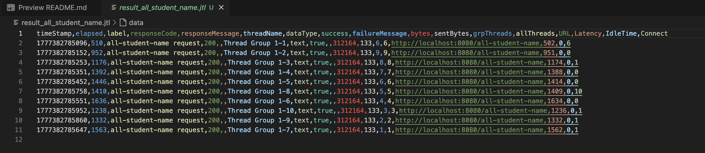
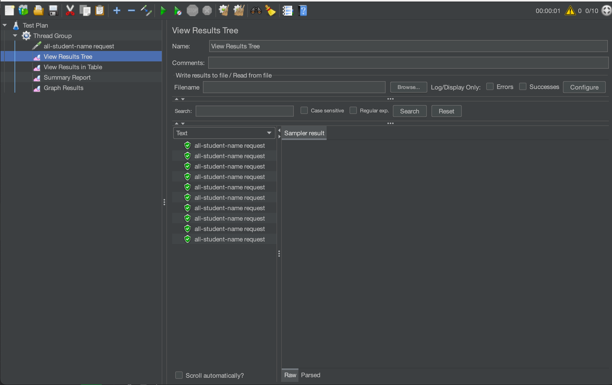
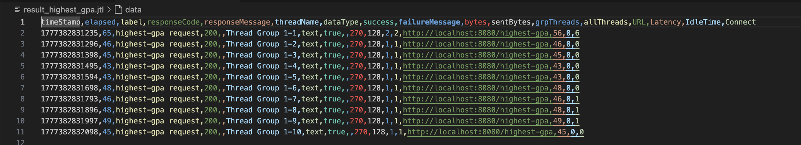
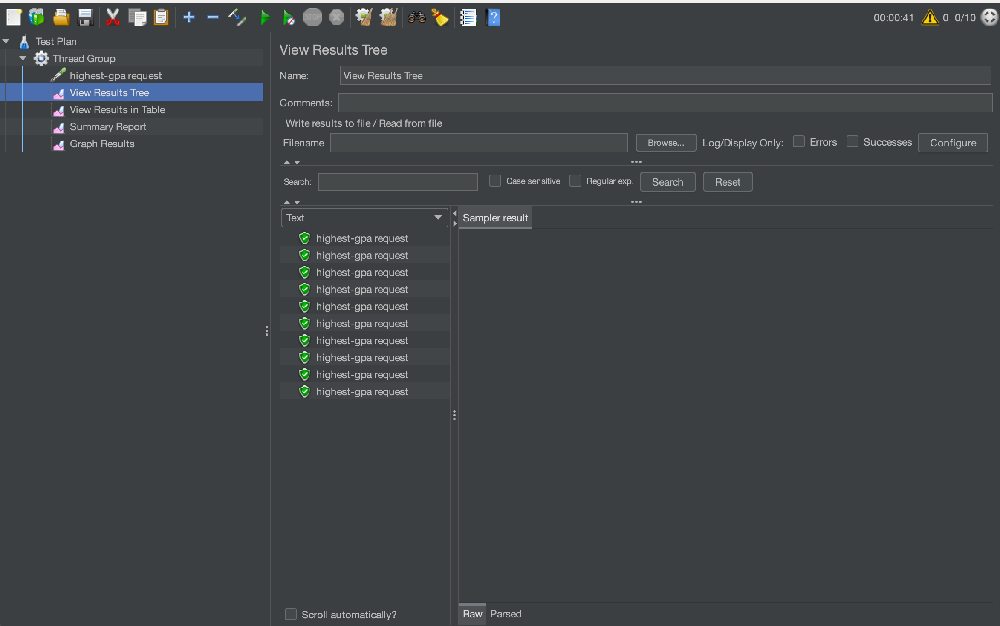

# Module 7 Exercise Profiling

## Performance Test Results

### Endpoint `/all-student-name`

| Metric | Value |
| --- | ---: |
| Test plan | `test_plan_2.jmx` |
| Result log | `result_all_student_name.jtl` |
| Samples | 10 |
| Average response time | 1265 ms |
| Minimum response time | 510 ms |
| Maximum response time | 1636 ms |
| Throughput | 4.6 requests/second |
| Error rate | 0.00% |

### Endpoint `/highest-gpa`

| Metric | Value |
| --- | ---: |
| Test plan | `test_plan_3.jmx` |
| Result log | `result_highest_gpa.jtl` |
| Samples | 10 |
| Average response time | 47 ms |
| Minimum response time | 43 ms |
| Maximum response time | 65 ms |
| Throughput | 10.4 requests/second |
| Error rate | 0.00% |

